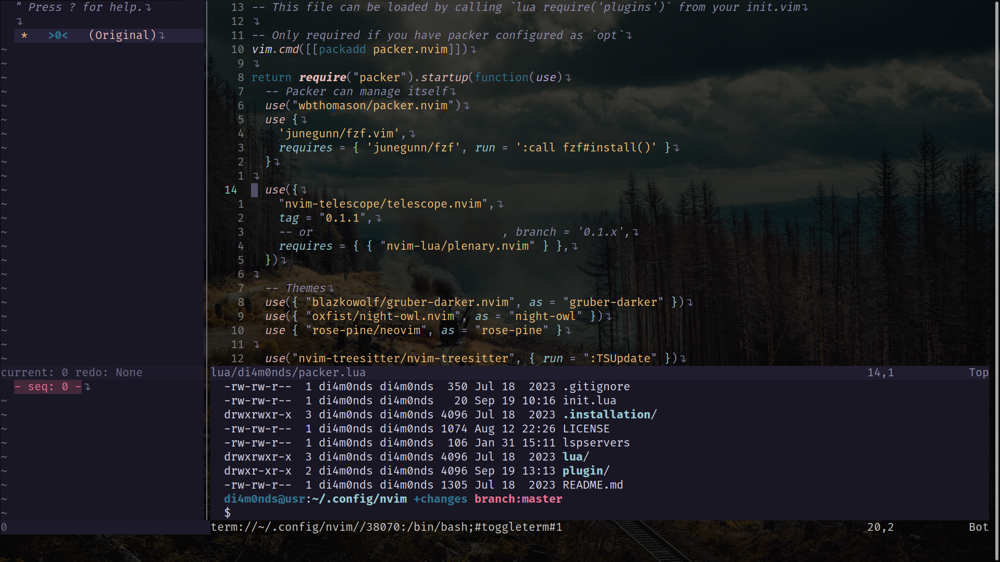

# The most powerful code editor ever
 Neovim Configuration with Lua Script

## Prerequisites
- Neovim version **0.9.0 or higher** is required.

> _Please make sure you have Neovim installed with a version equal to or greater than 0.9.0._

## Preview

## OS Installations
* [Windows - Scoop Package Manager](https://github.com/di4m0nds/nvim.lua/tree/master/.installation/OS/win)
* [Linux](https://github.com/di4m0nds/nvim.lua/tree/master/.installation/OS/linux)
  * [Ubuntu](https://github.com/di4m0nds/nvim.lua/tree/master/.installation/OS/linux/ubuntu)

## References:
* [Neovim GitHub Repository](https://github.com/neovim/neovim) - Official GitHub repository for Neovim.
* [Neovim Releases](https://github.com/neovim/neovim/releases) - Neovim releases page on GitHub, where you can find different versions of Neovim.
* [Neovim Documentation](https://neovim.io/doc/user/) - Official Neovim documentation for user reference.
* [Packer.nvim GitHub Repository](https://github.com/wbthomason/packer.nvim) - Official GitHub repository for Packer.nvim, a plugin manager for Neovim.
* [di4m0nds's dotfiles](https://github.com/di4m0nds/dotfiles/tree/master/_neovim-config-lua) - di4m0nds's older Neovim configuration, providing an example of a different configuration approach.
* [ThePrimeagen/init.lua](https://github.com/ThePrimeagen/init.lua) - A repository containing ThePrimeagen's Neovim configuration.
